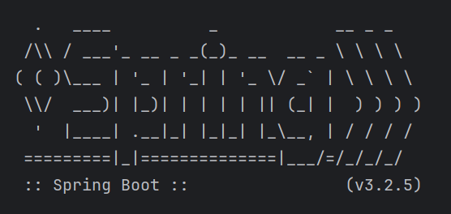
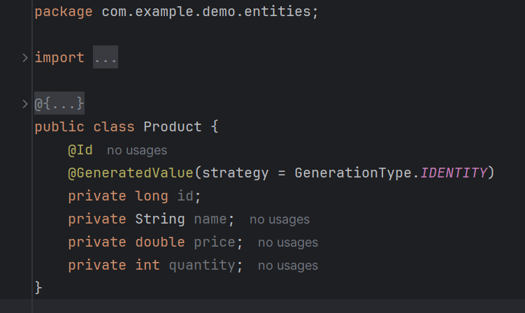
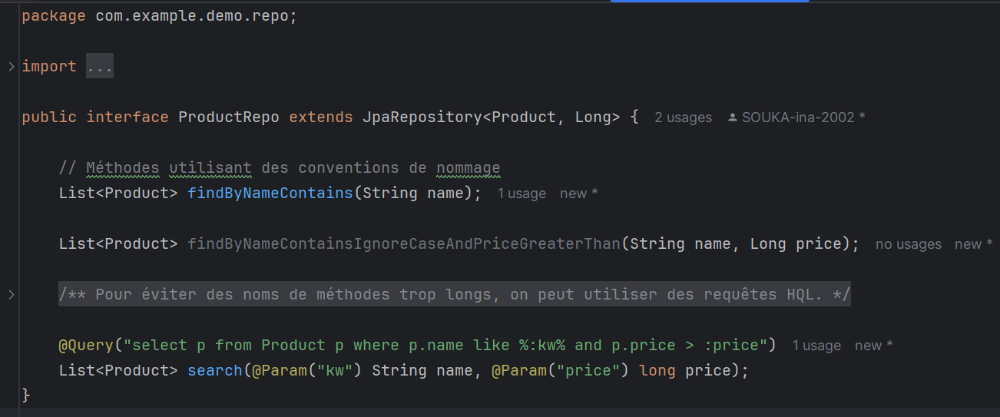

<h1> Application Spring</h1>

<h5> Pour accéder à une base de données via une application Java, il existe trois façons principales :</h5>
<h3>1- Utiliser directement l'API JDBC  </h3>
<h5>L'utilisation de l'API JDBC permet une interaction directe avec la base de données en utilisant des requêtes SQL. Cette méthode est plus bas niveau et nécessite de gérer les connexions, les déclarations, et les résultats manuellement. </h5>

<h3>2- Utiliser l'API JPA et l'une de ses implementations comme Hibernate</h3>
<h5>L'API JPA (Java Persistence API) offre une abstraction au-dessus de JDBC et permet de manipuler les données de manière plus orientée objet. Hibernate est l'une des implémentations les plus populaires de JPA.</h5>

<h3>3- Utiliser le framework Spring Data :</h3>
<h5> Spring Data facilite énormément le travail avec les bases de données en fournissant une abstraction supplémentaire. Avec Spring Data, vous avez juste besoin de créer des entités :

et des interfaces qui héritent de `JpaRepository` pour gérer ces entités.
</h5>

